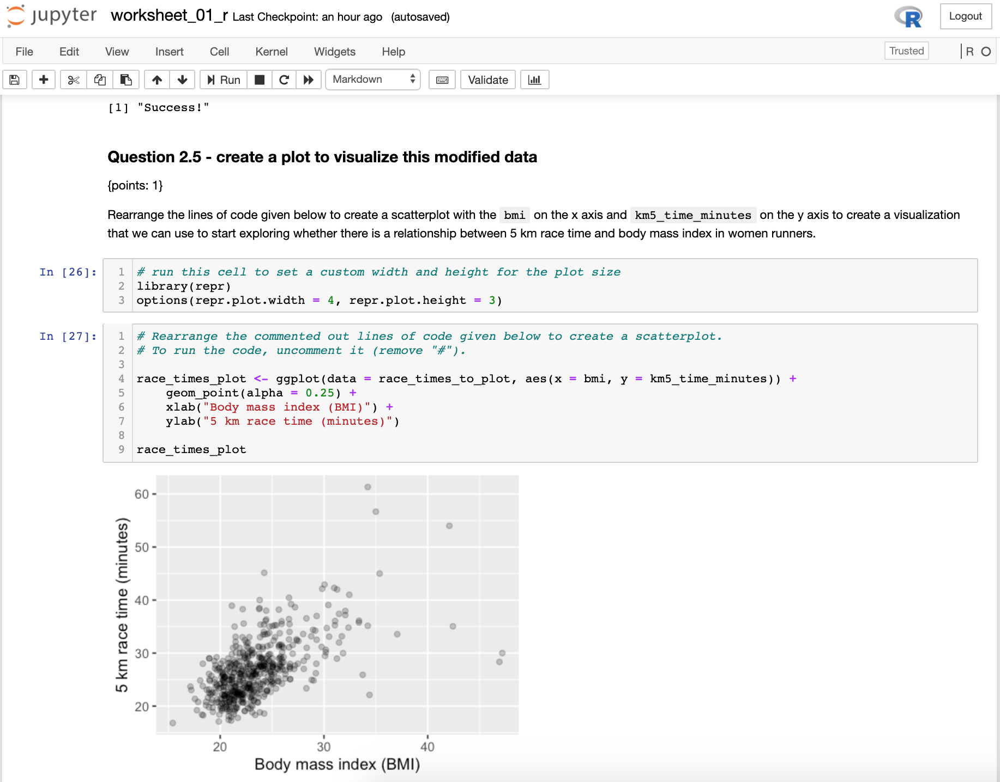
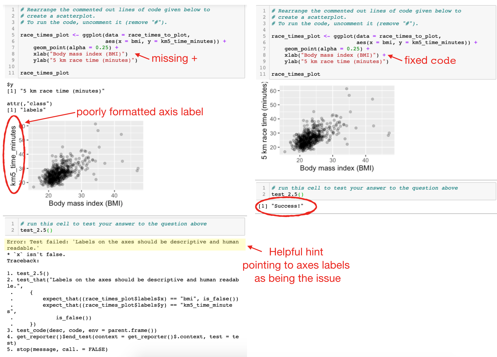
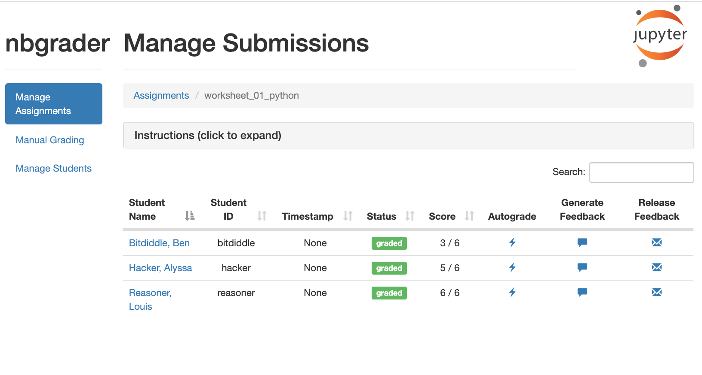
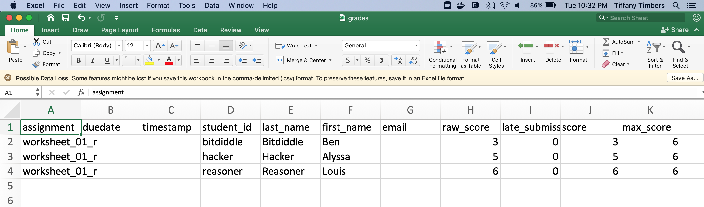
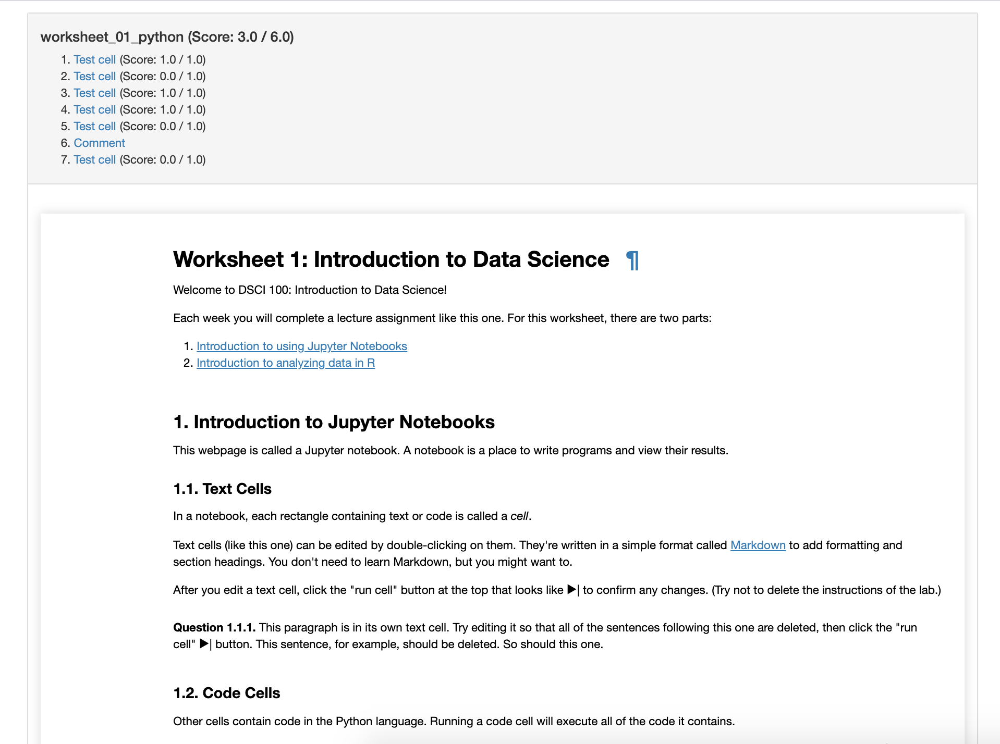
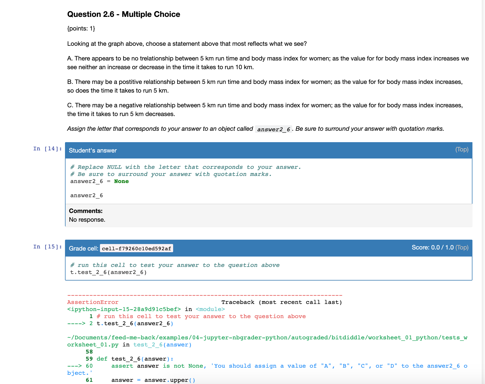

```{r xaringan-themer, include=FALSE, warning=FALSE}
library(xaringanthemer)
# color inspiration: pantone 2020 colors
# https://store.pantone.com/uk/en/color-of-the-year-2020-palette-exploration
style_duo_accent(
  primary_color = "#0F4C81",   # pantone classic blue
  secondary_color = "#DBCCBE", # pantone pink tint
  black_color = "#7A8387",     # pantone monument
  text_color = "#2A2A35",      # pantone night sky
  header_font_google = google_font("Arvo"),
  text_font_google   = google_font("Montserrat", "300", "300i"),
  code_font_google   = google_font("Source Code Pro"),
  title_slide_text_color = "white"
)
```

```{r load-packages, include=FALSE}
library(tidyverse)
library(usethis)
```

background-position: center
background-repeat: no-repeat
background-size: contain
class: middle

# Automated feedback: 
# what and why?

---

## The why

--
.pull-left[
.center[
.huge[`r emo::ji("point_right")`] <br>
.large[**Nudging**] <br>
students towards the right answer, especially in formative assessments
]
]
--
.pull-right[
.center[
.huge[`r emo::ji("heavy_plus_sign")`] <br>
.large[**Scaling**] <br>
up efficiency of grading faster than (human) resources
]
]

---

background-image: url(images/robot-r-python.jpeg)
background-position: center
background-repeat: no-repeat
background-size: contain
class: middle

## The what

### Jupyter + nbgrader + R

---

## What is Jupyter?


.pull-left[
```{r echo=FALSE, fig.align="center", out.width="150%"}

```
]
--
.pull-right[
```{r echo=FALSE, fig.align="center", out.width="100%"}

```
]

---

## Tests as automated feedback

```{r echo=FALSE, fig.align="center", out.width="75%"}

```

---

## Autograding via nbgrader

```{r echo=FALSE, fig.align="center", out.width="75%"}

```

---

## Autograding via nbgrader

```{r echo=FALSE, fig.align="center", out.width="75%"}

```

---

## Autograding via nbgrader

.pull-left[
```{r echo=FALSE, fig.align="center", out.width="130%"}

```
]
--
.pull-right[
```{r echo=FALSE, fig.align="center", out.width="130%"}

```
]

---

background-image: url(images/robots-demo.jpeg)
background-position: center
background-repeat: no-repeat
background-size: contain
class: middle

## Demo: Jupyter + nbgrader with R

[**`[R code]`**](https://github.com/ttimbers/jupyter-nbgrader-r)

---

background-image: url(images/robots-demo.jpeg)
background-position: center
background-repeat: no-repeat
background-size: contain
class: middle

## Demo: Jupyter + nbgrader with Python

[**`[Python code]`**](https://github.com/mine-cetinkaya-rundel/feed-me-back/tree/master/examples/04-jupyter-nbgrader-python)

---

## Best practices for automated feedback

--

- Measure twice, cut once (verify the correctness of your tests) 📏📏 ✂️

--

- Use rounding & type coercion to write robust tests 💪

--

- Use hashing to hide solutions for visible tests 🕵️

--

- Test your tests on the students compute environment 💻

--

- Abstract your tests to a script that is sourced/imported into the students literate code document 📁

--

- Don't give automated feedback on everything 🙈

--

- Consider peer feedback where automated feedback is not feasible (e.g. interpretation, narrative) but scalability is an issue 👯

---

## Jupyter / nbgrader Resources
- [nbgrader documentation](https://nbgrader.readthedocs.io/en/stable/)
- [Examples of R Jupyter notebooks with automated feedback from UBC's DSCI 100 course](https://github.com/UBC-DSCI/dsci-100-assets/tree/master/2019-spring/materials)
- [Examples of Python Jupyter notebooks with automated feedback from Berkley's data8 course](https://github.com/data-8/data8assets/tree/gh-pages/materials/su17/lab)

## Attribution
- slides and example derived from a talk given by Mine Çetinkaya-Rundel 
(University of Edinburgh, Duke University, RStudio) & myself at ECOTS 2020: [bit.ly/feed-me-back](https://bit.ly/feed-me-back)

---

## Tiffany Timbers
.large[
`r fontawesome::fa(name = "envelope", fill = "#0F4C81")` tiffany.timbers@stat.ubc.ca  
`r fontawesome::fa(name = "twitter", fill = "#0F4C81")` TiffanyTimbers 
`r fontawesome::fa(name = "github", fill = "#0F4C81")` ttimbers  
] 


<br><br>

.center[
## `r emo::ji('link')` [ttimbers.github.io/jupyter-nbgrader-r](https://ttimbers.github.io/jupyter-nbgrader-r/)
]                 
